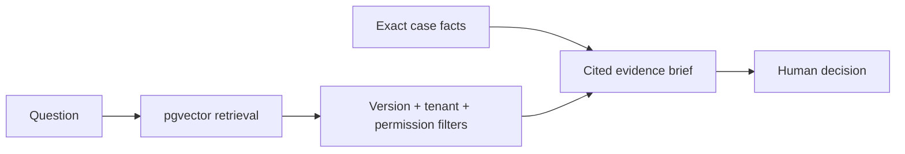

# Production RAG Fraud Investigation Lab

Investigate a suspicious `$4,850` payment with two pipelines:

- **Naive RAG** retrieves the most semantically similar documents.
- **Production RAG** verifies document versions, tenant boundaries and permissions before evidence
  reaches the answer.

The project runs without an API key. Embeddings and answer language are pregenerated; retrieval,
filtering, ranking and citations remain inspectable and executable.

## The question

Elena M. has a four-year-old account and normally spends `$50–$300`. A new device places a `$4,850`
camera order from a Singapore hosting network, using her trusted Berlin delivery address.

Is it a legitimate purchase or an account takeover—and what should the analyst do next?

## What makes the demo interesting

The dataset contains three deliberate traps:

1. A superseded fraud policy has a higher similarity score than the current policy.
2. A confidential merchant watch note is highly relevant but unavailable to the analyst.
3. A nearly identical account-takeover case belongs to another tenant.

Naive retrieval uses them. The production pipeline rejects them and recommends manual review plus
step-up authentication instead of an automatic block.

## Quick start — pgvector mode

Requirements: Docker with Docker Compose.

```bash
docker compose up --build
```

Open [http://localhost:8000](http://localhost:8000). No `.env` file or API key is required.

The first run downloads the Python and pgvector images. Later runs reuse them.

To stop the project:

```bash
docker compose down
```

Use `docker compose down -v` only when you intentionally want to delete the local demo database.

## Fast fixture mode

Fixture mode uses the same deterministic ranking and filters in memory. It is useful for reading
the code or running the UI without PostgreSQL.

```bash
python3 -m venv .venv
source .venv/bin/activate
pip install -r requirements.txt
DEMO_STORAGE=fixture uvicorn app.main:app --reload
```

## Guided investigation

1. Choose **Naive RAG** and select one of the four investigation questions.
2. Click **Run investigation** and follow the highlighted retrieval stages.
3. Inspect the included evidence and notice the old policy or restricted source.
4. Switch to **Production RAG** and run the same question.
5. Compare the included and rejected evidence, including the reason for every exclusion.
6. Compare the final action, then repeat for policy, device history and similar cases.

The app waits for the user to start each run. Every question produces a distinct evidence brief, so
changing the dropdown changes both the retrieved context and the investigation result.

## Input data

All data is synthetic and lives in `data/`.

| Input | Purpose |
| --- | --- |
| `case.json` | Exact transaction and customer facts |
| `documents.json` | Policies, customer/device records, merchant data and historical cases |
| `questions.json` | Four fixed investigation questions |
| `query_embeddings.json` | Pregenerated vectors for those questions |

Each evidence document carries the metadata required to make a production decision: active status,
version, tenant, allowed roles and publication date.

## Architecture



See [docs/architecture.md](docs/architecture.md) for the detailed boundaries.

## API

FastAPI documentation is available at [http://localhost:8000/docs](http://localhost:8000/docs).

- `GET /health` — storage mode and readiness.
- `GET /api/scenario` — case and supported questions.
- `POST /api/investigate` — run one question through one pipeline.
- `GET /api/compare/{question_id}` — return both modes for comparison.

Example:

```bash
curl -X POST http://localhost:8000/api/investigate \
  -H 'Content-Type: application/json' \
  -d '{"question_id":"risk-signals","mode":"production"}'
```

## Tests and evaluation

The core test suite requires only Python's standard library:

```bash
python3 -m unittest discover -s tests -v
python3 scripts/evaluate.py
```

The evaluation verifies that production mode rejects stale, restricted and cross-tenant evidence,
returns citations and recommends human verification.

## Repository map

```text
app/
  main.py             FastAPI application
  pipeline.py         retrieval trace and evidence brief
  repository.py       fixture and PostgreSQL/pgvector repositories
  static/             dependency-free browser UI
data/                  synthetic evidence and pregenerated embeddings
docs/                  architecture and live-mode extension notes
scripts/evaluate.py    deterministic production checks
tests/                 core behavior tests
```

## Exercises

1. Activate the old policy and observe how the evidence changes.
2. Give the analyst access to the confidential note, then decide whether relevance makes it reliable.
3. Move a historical case to the current tenant.
4. Add a second current policy and define a conflict-resolution rule.
5. Add an evaluation that fails when a citation points to rejected evidence.
6. Implement free-text questions using the extension plan below.

## Optional live mode

Live embeddings and model-generated answers are outside the implemented scope. The extension points
and safe implementation order are documented in [docs/live-mode.md](docs/live-mode.md).

A subscriber can add an external AI provider or a local model later. The demo itself remains fast,
free and reproducible.

## Limitations

- The data and fraud scenario are fictional.
- Embeddings are deliberately small and human-designed for teaching.
- The evidence brief is deterministic, not model-generated.
- This is an educational architecture lab, not fraud, legal or compliance advice.
- The assistant recommends the next action; a person makes the final decision.
