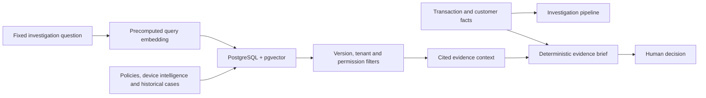

# Architecture

The project separates evidence retrieval from answer construction so each boundary is visible.

## What is real in demo mode

- pgvector ranks documents using the supplied query vector.
- The production query filters active versions, tenant boundaries and access roles in SQL.
- Structured case facts remain separate from semantically retrieved documents.
- Every displayed citation maps to an included source.
- The same dataset can be run through an intentionally unsafe similarity-only pipeline.

## What is pregenerated

- Document embeddings.
- Query embeddings for the four investigation questions.
- The language of the final evidence brief.

Pregeneration removes the external model dependency without hiding the retrieval and evidence
validation behavior the lab is designed to teach.

## Key modules

- `app/repository.py`: fixture and pgvector retrieval implementations.
- `app/pipeline.py`: validation trace and deterministic evidence brief.
- `app/main.py`: FastAPI endpoints and static application delivery.
- `data/`: scenario, source documents and embeddings.
- `scripts/evaluate.py`: small, deterministic safety evaluation.
